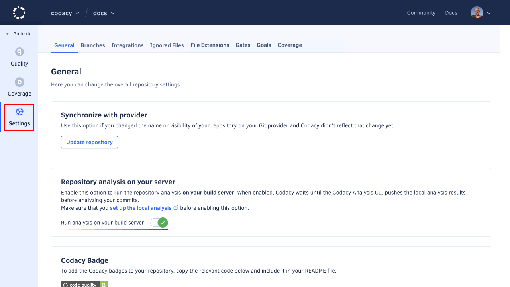

# Codacy CLI V2 GitHub Action

[](https://app.codacy.com/gh/codacy/codacy-cli-v2-action/dashboard?utm_source=gh&utm_medium=referral&utm_content=&utm_campaign=Badge_grade)

GitHub Action for running Codacy static analysis on [over 40 supported languages](https://docs.codacy.com/getting-started/supported-languages-and-tools/) and returning identified issues in the code.

<br/>

<a href="https://www.codacy.com" target="_blank"></a>

<br/>

[Codacy](https://www.codacy.com/) is an automated code review tool that makes it easy to ensure your team is writing high-quality code by analyzing more than 40 programming languages such as PHP, JavaScript, Python, Java, and Ruby. Codacy allows you to define your own quality rules, code patterns and quality settings you'd like to enforce to prevent issues on your codebase.

## About the CLI V2

The `codacy-cli-v2` is a command-line tool for Codacy that supports analyzing code using ESLint and uploading the results in SARIF format to Codacy. It provides two main commands: `analyze` and `upload`.

Details can be found [here](https://github.com/codacy/codacy-cli-v2).

> [!WARNING] 
> Currently only the `eslint` tool is supported.

## Requirements

- A Repository on GitHub and Codacy
- A project token
- A valid [codacy-cli-v2 configuration file](https://github.com/codacy/codacy-cli-v2?tab=readme-ov-file#important-concepts) (usually achieved by running `codacy-cli-v2 init` in the root of your repository)
- If you want to upload the report to Codacy, you need to set the `upload_report` input to `true` and enable the flag "Run analysis on your build server" on the repository settings on Codacy.

    


## Usage

```yaml
steps:
# ...
    - name: Run Codacy CLI
        uses: codacy/codacy-cli-v2-action@tests
        with:
          project_token: ${{ secrets.CODACY_PROJECT_TOKEN }}
          tool: eslint
          upload_report: true
# ...
```

## Inputs

| Input | Required | Default | Description |
| ----- | -------- | ------- | ----------- |
| `project_token` | Yes | - | The project token for your Codacy project. |
| `tool` | Yes | - | The tool to use for analysis. |
| `upload_report` | No | false | Whether to upload the report to Codacy. |
| `sarif_file_path` | No | "./report.sarif" | The path to the SARIF file to upload. |
